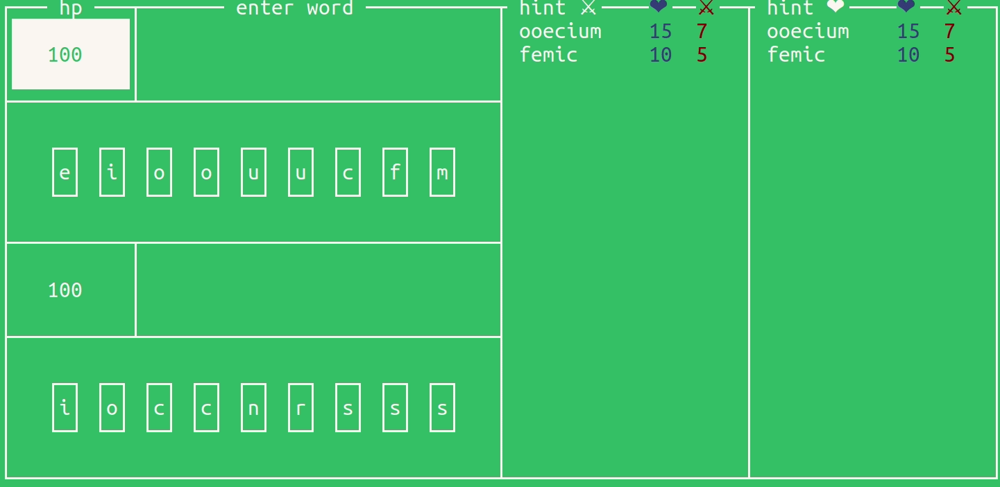

# Sigma

  </img>

## Правила

1.
В игру играют два игрока и ходят по очереди

2. 
У игрока есть `hp`, которое в начале игры равняется `100`

3. 
У игрока всегда есть `9` букв

4. 
Каждое слово в игре имеет два параметра 
 - очки здоровья ❤
 - очки урона ⚔

Используя слово, игрок добавляет к своим очкам ❤ и отнимает у противника ⚔

5. 
Каждое слово может быть использовано не более раза. Минимальная длина слова равняется `5`

6.
Правила подсчета очков 

❤: количество гласных букв `a e i u o` в слове помножненное на `10 - x`, где `x` - длина слова 

⚔: `x`
 - если длина `8`, то `16`
 - если длина `9`, то `27`

7.
Проигрывает тот игрок, у которого остается `0` или меньше `hp`

## Особенности

- Если из букв нельзя собрать слов, то `hp` делиться на `2` с округлением вниз, а буквы случайным образом меняются
- Буквы генерируется с особым распределением, учитывая частоту символов во всех словах
- Интерфейс игры содержит 2 поля подсказок
	- в первом поле собраны самые лучшие слова относительно ⚔
	- во втором поле аналогично относительно ❤
- Дополнительно подсвечиваются буквы, которые уже введены
- Не получится ввести слово, которое нельзя составить из имеющихся букв
- Если введено слово, которое уже было, или оно не из словаря, то ничего не произойдет, пока игрок не введет корректное слово
- В подскасках всегда написаны слова, которые `можно` написать
- Буквы можно убирать обычным `backspace`

## Как попробовать в это зарубиться?

1. `git clone ...`
2. `cd sigma`
3. `mkdir release`
4. `cd release`
5. `cmake -DCMAKE_BUILD_TYPE=Release ..`
6. `make`
7. `./app`

